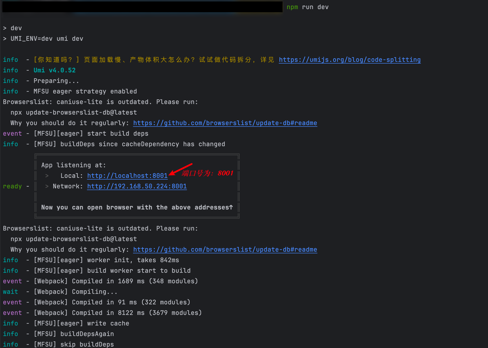

# utools_app_demo[开始摸鱼]

## 目录
- doc `存储插件上架图片`
- mdImg `存储markdown图片`
- relase `上架代码`
- src `插件代码`

## 本地开发命令
1. 下载项目依赖
在项目根目录下执行
```bash
pnpm install
```

2. 启动项目
在项目根目录下执行
```bash
npm run dev
```

3. 打包项目
在项目根目录下执行
```bash
npm run build
```

## 本地调试

1. 启动项目
在项目根目录下执行
```bash
npm run dev
```
命令执行完毕后，会在控制台显示端口号，需要拿到端口号在后面使用

2. 修改插件配置
找到插件配置文件，位置`utools_app_demo/relase/plugin.json`，找到`development`下的`main`，修改为本地调试的地址和端口号

```json
{
  "development": {
    "main": "http://localhost:8001"
  }
}
```
3. 在uTools中打开`uTools开发者工具`，进行详细配置


## 插件发布
1. 打包项目，打包命令上面有，打包后会在根目录下生成`dist`文件夹
2. 将`relase`目录下的dist文件夹删除，将打包好的dist文件夹复制到`relase`目录下
3. 在uTools中打开`uTools开发者工具`，进行插件发布，发布即可